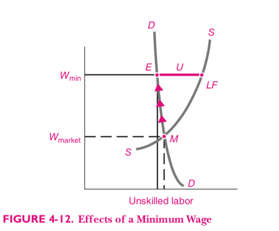
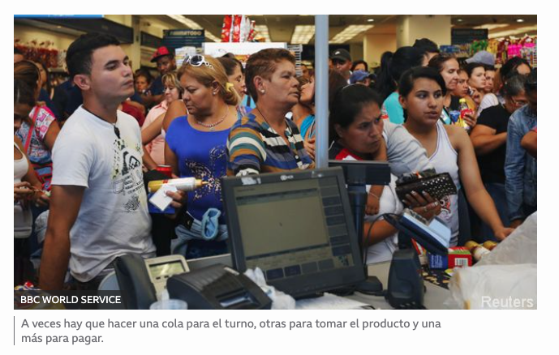
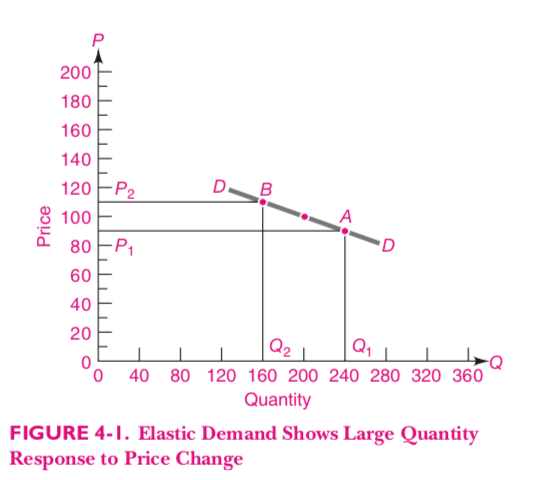
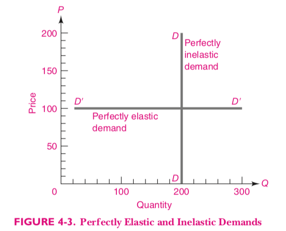
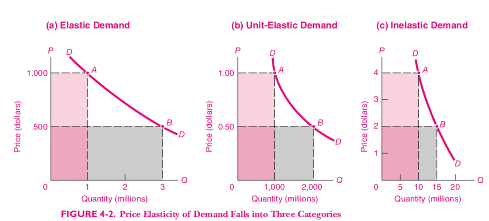
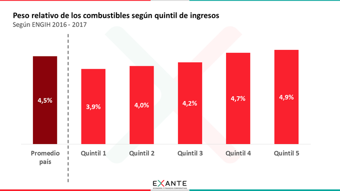
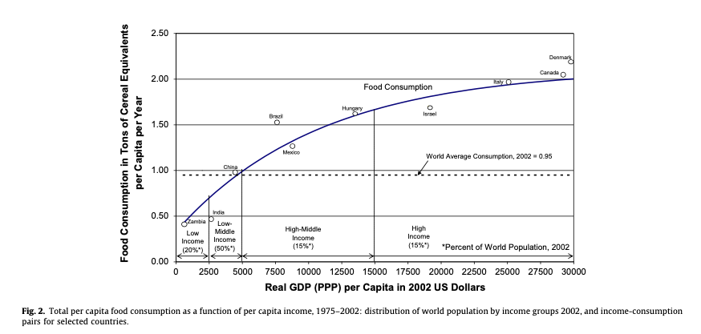
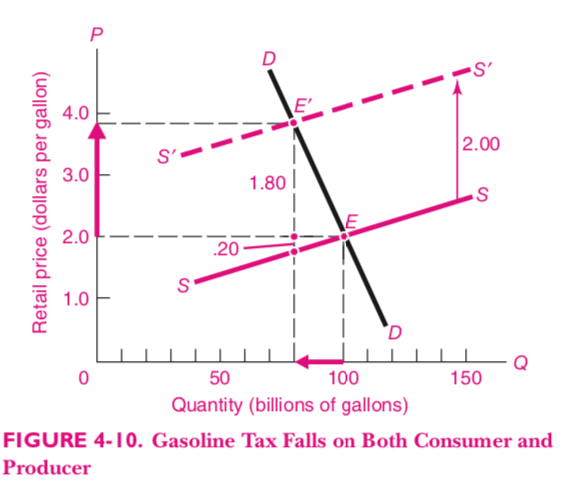

```{r setup, include=FALSE}
options(htmltools.dir.version = FALSE)
knitr::opts_chunk$set(
  fig.width=6, fig.height=3.5, fig.retina=3,
  out.width = "100%",
  cache = FALSE,
  echo = FALSE,
  message = FALSE, 
  warning = FALSE,
  hiline = TRUE,
  dev = "png", 
  dev.args = list(type = "cairo-png")
)
library(ggplot2)
library(showtext)
font_add_google("Lato", "Lato")
font_add_google("Merriweather", "Merriweather")
theme_set(theme_minimal(base_family = 'Lato', base_size=16))
```

```{r xaringan-themer, include=FALSE, warning=FALSE}
library(xaringanthemer)


colores <- c(celeste="#5e82ae", 
             color3="#89a2c3",
             color1="#698BB4",
             color2="#5D81AD",
             verde="#4E7B7B")

# ,,5D81AD,,000000
style_mono_accent(
  base_color = "#5e82ae",
  #secondary_color = "",
  header_font_google = google_font("Lato"),
  text_font_google   = google_font("Merriweather"),
)
```

background-image: url(imgs/demanda.jpg)
background-position: bottom right
background-size: 900px

## La Demanda

---
# Cantidad demandada

- Es la cantidad que alguien está dispuesto a comprar de ese bien adeterminado precio.

???
Las variables relevantes son precio y cantidad.

---
# La curva de demanda

- Es la __relación__ entre la cantidad demandada y el precio del bien.

- Podemos escribirla como una función: $$ Q_d = Q(p) $$

- Cuanto menor es el precio del bien, mayor es la cantidad demandada.


???

En matemáticas usamos funciones para analizar relaciones entre variables.

---
## Dos formas de visualizarla

.pull-left[
```{r tabla-demanda}
library(tibble)

tribble(
  ~Precio, ~`Cantidad Demandada`,
  10, 0,
  8,  10,
  6,  20,
  4,  30,
  2,  40,
  0,  125) %>% 
  knitr::kable()
```


]
.pull-right[

```{r plot-demanda}
df <- tribble(
  ~precio, ~cantidad, ~lab, ~momento,
  5,     9,           "A",  "Después",
  4,     10,          "B",  "Después",
  3,     12,          "B",  "Después",
  2,     15,          "D",  "Después",
  1,     20,          "E",  "Después"
)

ggplot(df, aes(x=cantidad, y=precio)) +
  geom_line(color = "#5e82ae") +
  geom_point(color = "#5e82ae") +
  xlim(5, 20) +
  ylim(0, 5) +
  labs(x="Cantidad",
       y="Precio",
       title = "Demanda de Maíz"
       ) +
  theme(legend.position = "none")
```
]


---

# Variables endógenas y variables exógenas

- Las variables endógenas son los efectos.

- Las variables exógenas son las causas.

- En el modelo de demanda, las variables endógenas son

  - La cantidad
  
  - El precio

---
# Cambios en la demanda

- Las exógenas son los __factores que explican la demanda__

  - Ingreso de los consumidores
  
  - Tamaño del mercado
  
  - Disponibilidad y precio de bienes relacionados (sustitutos y complementarios)
  
  - Preferencias de los consumidores 
  
  - Factores coyunturales

- Cambian la __relación__ entre $Q_d$ y $P$.

---
# Bienes Sustitutos


- Si dos bienes son sustitutos, el aumento del precio de uno hace que aumente la demanda del otro.

- Si sube el precio del pescado, la demanda de carne aumenta, porque los consumidores demandan más carne para sustituir el pescado que consumían a precios menores.

---
# Bienes Complementarios

- Si dos bienes son complementarios, el aumento del precio de uno hace que disminuya la demanda del otro.

- Si aumentan los precios de las consolas de videojuegos, la demanda por los juegos disminuye.

---
# Aumento en la demanda

.pull-left[

- Al mismo precio, la cantidad demandada es mayor.

]

.pull-right[
```{r aumento-demanda}

library(dplyr)

df_2 <- bind_rows(
  df,
  mutate(df,
         momento = "Antes",
         cantidad = cantidad-5)
)

ggplot(df_2, aes(x=cantidad, y=precio, color=momento)) +
  geom_line(aes(color=momento)) +
  geom_point() +
  xlim(0, 20) +
  ylim(0, 5) +
  scale_color_manual(values=c(colores[["celeste"]], colores[["verde"]])) +
  annotate("segment", x = 6, xend = 9, y=4, yend=4, arrow = arrow(length = unit(0.2, "cm"))) +
  annotate("segment", x = 11, xend = 14, y=2, yend=2, arrow = arrow(length = unit(0.2, "cm"))) +
  labs(x="Cantidad de Maíz",
       y="Precio del Maíz",
       title = "Demanda de Maíz",
       subtitle = "")  + 
  guides(color="none")
```
]

---

## La curva de oferta

- Es la __relación__ entre la cantidad ofrecida por los venderores y el precio del bien.

- Podemos escribirla como una función: $$ Q_s = Q(p) $$

- Cuanto mayor es el precio del bien, los productores van a producir más. 


---
## Dos formas de visualizarla

.pull-left[
```{r tabla-oferta}
df_oferta <- tibble(p=seq(.5, 2.5, by=.5),
                    q=c(0, 6, 10, 13, 15),
                    curva="Oferta")

df_oferta %>% 
  select(-curva) %>% 
  knitr::kable(col.names=c("Precio", "Oferta"))
```

]

.pull-right[
```{r plot-oferta}
ggplot(df_oferta, aes(x=q, y=p)) +
  geom_line(color=colores[["celeste"]]) +
  geom_point(color=colores[["celeste"]]) +
  labs(x="Cantidad",
       y="Precio",
       title = "Oferta de Maíz") + 
  theme(legend.position = "none")
```
]

---

# Cambios en la oferta

- Precios de los inputs

- Tecnología

- Precios de bienes relacionados (sustitutos o complementarios)

- Políticas del gobierno

- Factores coyunturales de cada mercado

---

# Aumento en la oferta


.pull-left[
- Al mismo precio, la cantidad ofrecida es mayor
]

.pull-right[
```{r aumento_oferta}
df_oferta_2 <- tibble(p=seq(.5, 2.5, by=.5),
                    q=c(7, 15, 20, 25, 27),
                    curva="Oferta 2")

bind_rows(df_oferta, df_oferta_2) %>% 
  ggplot(aes(x=q, y=p, color = curva)) +
  geom_line() +
  geom_point() +
  scale_color_manual(values=c(colores[["celeste"]], colores[["verde"]])) +
  labs(x="Cantidad",
       y="Precio",
       title = "Oferta de Maíz") +
  annotate("segment", x = 15, xend = 22.5, y=2, yend=2, arrow = arrow(length = unit(0.2, "cm"))) +
  annotate("segment", x = 7.5, xend = 12.5, y=1, yend=1, arrow = arrow(length = unit(0.2, "cm"))) +
  theme(legend.position = "none")
```

]

---

# Equilibrio de mercado

- Se da cuando los vendedores y compradores están en __equilibrio__.

- Si nadie tiene incentivos a cambiar sus decisiones, la situación es estable, y estamos en equilibrio.

- Si al precio de mercado vigente, los demandantes compran la cantidad que los productores están dispuestos a ofrecer, el mercado está en equilibrio.

---

# Ejemplo

```{r equilibrio}

library(tidyr)


# TODO: usar arriba en vez de maiz
df_demanda <- tibble(
  p=seq(0.5, 2.5, by=.5),
  q=c(22, 15, 10, 7, 5),
  curva="Demanda"
)

df_equilibrio <- bind_rows(df_oferta, df_demanda) 


```

.pull-left[
```{r tabla-equilibrio}
df_equilibrio %>% 
  tidyr::pivot_wider(names_from=c(curva), values_from=q) %>% 
  knitr::kable(col.names = c("Precio", "Oferta", "Demanda"))
```

]
.pull-right[

```{r plot-equilibrio}
plot_equilibrio <- df_equilibrio %>% 
  ggplot(aes(x=q, y=p, color=curva)) + 
  geom_point() + 
  geom_point() + 
  geom_line() + 
  annotate("text", label="Oferta", x= 17.5, y=2.25) +
  annotate("text", label="Demanda", x= 18.5, y=1) +
  scale_color_manual(values=c(colores[["celeste"]], colores[["verde"]])) +
  guides(color="none") + 
  labs(x="Cantidad", y="Precio")

plot_equilibrio
```

]

---
## Desequilibrio (P=$2)


.right-column[
```{r}
plot_equilibrio + 
  annotate("segment", x=7.5, xend=12.5, y=2, yend=2, arrow=arrow(ends="both", length = unit(0.25, "cm"))) + 
  annotate("text", y=2.2, x=10, label="Exceso de Oferta")
```
]


---
## Desequilibrio (P=$1)

.right-column[
```{r}
plot_equilibrio + 
  annotate("segment", x=6.5, xend=14.5, y=1, yend=1, arrow=arrow(ends="both", length = unit(0.25, "cm")))+
  annotate("text", y=.85, x=10.3, label="Exceso de Demanda")
```
]

---
## Estática Comparativa

- Una vez desarrollado el modelo podemos aplicarlo para establecer relaciones causales entre variables observadas en la realidad.

- ¿Cómo responden las variables __endógenas__ a cambios en las variables __exógenas__?


---

.pull-left[
```{r}
df_estatica <- bind_rows(df_demanda, df_oferta, df_oferta_2)

df_estatica %>% 
  ggplot(aes(x=q, y=p, color=curva)) + 
  geom_line() + 
  scale_x_continuous(breaks=seq(0, 25, by=5)) +
  scale_color_manual(values=c(colores[["celeste"]], colores[["verde"]], "orange")) + 
  geom_point(data=filter(df_estatica, p==1.5, q==10)) + 
  geom_point(data=filter(df_estatica, p==1, q==15)) + 
  annotate("segment", x=15, xend=20, y=1.75, yend=1.75, arrow = arrow(length = unit(0.2, "cm"))) +
  annotate("segment", x=7.5, xend=12.5, y=1, yend=1, arrow = arrow(length = unit(0.2, "cm"))) +
  labs(x="Q", y="P", title="Aumento en la Oferta") + 
  guides(color="none")
```

- ⬆️ el precio
- ⬇️ la cantidad

]

.pull-right[
```{r}

df_demanda_2 <- tibble(
  p=seq(0.5, 3, by=.5),
  q=c(32, 25, 20, 17, 15, 14),
  curva="Demanda 2"
)

df_estatica_2 <- bind_rows(df_demanda, df_oferta, df_demanda_2) %>% 
  add_row(p=3, q=16, curva="Oferta") %>% 
  add_row(p=3, q=2.5, curva="Demanda")

df_estatica_2 %>% 
  ggplot(aes(x=q, y=p, color=curva)) + 
  geom_line() + 
  scale_y_continuous(breaks=seq(.5, 3, by=.5)) +
  scale_x_continuous(breaks=seq(0, 25, by=5)) +
  scale_color_manual(values=c(colores[["celeste"]], colores[["verde"]], "orange", colores[["verde"]])) + 
  geom_point(data=filter(df_estatica, p==1.5, q==10)) + 
  geom_point(data=filter(df_estatica, p==2.5, q==15)) + 
  annotate("segment", x=7.5, xend=12.5, y=2.5, yend=2.5, arrow = arrow(length = unit(0.2, "cm"))) +
  annotate("segment", x=17.5, xend=22.5, y=1, yend=1, arrow = arrow(length = unit(0.2, "cm"))) +
  labs(x="Q", y="P", title="Aumento en la Demanda") + 
  guides(color="none")
```

- ⬆️ el precio
- ⬆️ la cantidad
]

---
background-image: url(imgs/commodities_guerra.jpeg)

---

```{r}


df_oferta %>% 
  bind_rows(df_oferta_2) %>% 
  bind_rows(df_demanda)
  
```


---
# Precios mínimos

.pull-left[
- En el mercado de trabajo, el precio es el salario.

- El salario mínimo es un precio mínimo.
]


.pull-right[

]

---

# Precios mínimos (2)

- Si el gobierno fija un precio mínimo mayor que el precio de equilibrio, habrá un exceso de oferta en el mercado.

- Si el gobierno fija un precio mínimo menor que el precio de equilibrio, rige el precio de equilibrio.


---

# Precios máximos

- Si el gobierno fija un precio máximo menor que el precio de equilibrio, hay un exceso de demanda.

---
# Precios máximos en Argentina


---

# Precios máximos en Argentina (2)


---
# Precios máximos en Venezuela




---

# Precios máximos en Venezuela (2)


---
# Elasticidad Precio de la Demanda


- Ya sambemos que si el precio sube la cantidad demandada baja, la elasticidad precio de la demanda ( $E_p$ cuantifica esa caída.

- Mide __cuánto__ cambia la cantidad demandada cuando cambia el precio.

- Se calcula como el valor absoluto del cociente entre la variación porcentual en la cantidad y la variación porcentual en el precio:

$$ E_d = | \frac{ \Delta Q\%}{\Delta P \%} |$$

---
# Elasticidad Precio de la Demanda (2)


- La elasticidad de la demanda de un bien depende de varios factores:

  - Si el bien tiene muchos **sustitutos**, su demanda va a ser más elástica.
  
  - Si tomamos un **plazo de tiempo** largo, la demanda del bien es más elástica, porque los consumidores se ajustan mejor en el largo plazo.
  
  - Los **bienes de lujo** tienen demanda más elástica que los bienes de necesidad básica.

---
# Elasticidad Precio de la Demanda (3)


  - Si $E_p = 1$ el bien tiene **elasiticidad unitaria**. Eso implica que un cambio en 1% en el precio del bien implica un cambio de 1% en la cantidad demandada de ese bien.
  
  - Si $E_p > 1$ el bien tiene **demanda elástica**, un cambio de 1% en el precio del bien implica un cambio mayor a 1% en la cantidad demandada del bien.
  
  - Si $E_p < 1$ el bien tiene **demanda inelástica**, un cambio de 1% en el precio del bien implica un cambio menor a 1% en la cantidad demandada del bien.


---

# A tener en cuenta:

  - Usamos cambios porcentuales y no absolutos. Esto permite comparar elasticidades de distintos productos, y hace que los cálculos sean independientes de las unidades de medida.
  
  - Para calcular la variación porcentual, usamos el promedio del valor inicial y el final como denominador.

$$ \Delta P\%\ = \frac{\Delta P}{(P_0 + P_1) / 2}$$
Donde $\Delta P$ es la variación absoluta de $P$ ( $P_1 - P_0$ ), $P_0$ es el precio inicial y $P_1$ el precio final.

- Si no usamos valor absoluto, la elasticidad sería negativa.


---
# Ejemplo


.pull-left[

]

.pull-right[
- El precio pasa de 90 a 110.

- La cantidad pasa de 240 a 160.
]


---

# Ejemplo


.pull-left[

## Variación absoluta

- La variación absoluta del precio es 20.

- La variación absoluta de la cantidad es 80.
]

.pull-right[

## Variación porcentual

- La variación porcentual del precio es 20%. $(\frac{20}{\frac{90+110}{2}})$

- La variación porcentual de la cantidad es 40% $(\frac{80}{\frac{160+240}{2}})$.

]

---
# Casos extremos




---
# La elasticidad y los ingresos de las empresas

- Si hay un aumento en la oferta, baja el precio ( $P$ ) y sube la cantidad ( $Q$ ).

- ¿Qué pasa con el ingreso de las empresas ( $P \times Q$ )?

- Depende de la elasticidad de la demanda.

---
# Elasticidad e ingresos




---

# Elasticidad e ingresos

- Si la demanda es elástica, el aumento en $Q$ va a ser mayor que la caída en $P$, por lo que el ingreso total $P \times Q$ sube.

- Si la demanda es inelástica, el aumento en $Q$ va a ser menor que la caída en $P$ y el ingreso total $ P\times Q $ cae.

- Si la elasticidad es unitaria, $Q$ cae en la misma proporción que $P$ sube.


---
# Elasticidad Ingreso del combustible




---
# Elasticidad Ingreso de la demanda de combustibles

- El quintil más pobre de los hogares Uruguayos gasta 3,9% de sus ingresos en combustible.
- El quintil más rico gasta 4.9%.
- Cuando aumenta el ingreso, la participación de los combustibles en el prespuuesto total aumenta.
---

# Elasticidad Ingreso de la demanda de alimentos



---
# Elasticidad Ingreso de los Alimentos

- A medida que los países se hacen más ricos, su gasto en alimentos aumenta, pero la participación de los alimentos en el gasto total decrece.

---
# Efecto de un impuesto

- Incidencia legal vs. incidencia económica

- A veces los productores pueden trasladar todo el peso del impuesto a los consumidores.

- Depende de las elasticades relativas de oferta y demanda.

---
# Análisis económico




---
# Análisis económico (2)

- El equilibrio inicial es con un precio de $2 y 100 billones de galones vendidos.

- El impuesto hace que la oferta se desplace hacia la izquierda por $2.

- Esto se debe a que ahora los productores tienen que recibir $2 más por galón para producir la misma cantidad que antes.

- El nuevo equilibrio (E'), el precio es $3.8 y la cantidad 80 billones de galones. De esos $3.8, los productores reciben $1.8 y pagan $2 de impuestos, pero lograron trasladar la mayor parte de la suba a los consumidores.


